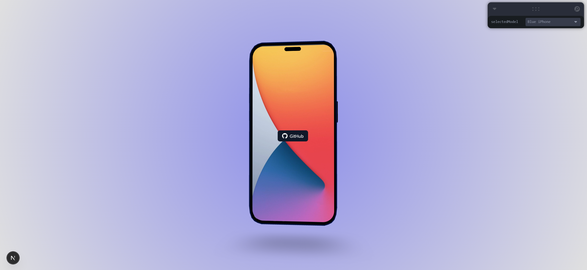

# 3D iPhone Showcase - Interactive 3D Model Viewer

A 3D interactive iPhone showcase built with React Three Fiber and Three.js, featuring orbit controls and customizable screen content for portfolio display.



## Features

- **Orbit Controls** - Click and drag to rotate around the iPhone model
- **Model Switching** - Change between different iPhone colors (Blue, Green, Black, Red)
- **Interactive Screen** - Customizable HTML content displayed on the phone screen
- **Floating Animation** - Smooth floating effect for the iPhone model
- **Responsive Design** - Works on desktop and mobile devices

## Controls

- **Click & Drag** - Rotate camera around the iPhone
- **Scroll** - Zoom in/out
- **Model Selector** - Use Leva controls to switch iPhone colors
- **Screen Content** - Interactive buttons and links on the phone screen

## Quick Start

```bash
npm install
npm run dev
```

## Tech Stack

- **Next.js** - React framework with TypeScript
- **Three.js** - 3D graphics library
- **React Three Fiber** - React renderer for Three.js
- **React Three Drei** - Useful helpers for React Three Fiber
- **Tailwind CSS** - Utility-first CSS framework
- **Leva** - GUI controls for development
- **GLTF Models** - 3D iPhone models created in Blender

